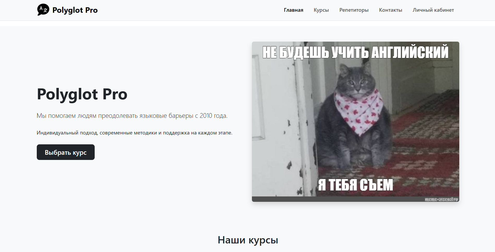
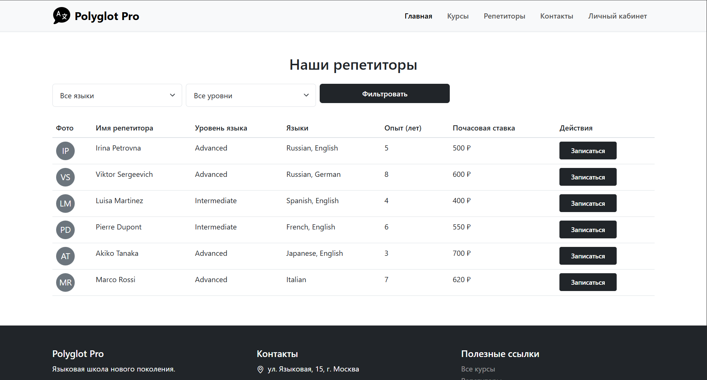
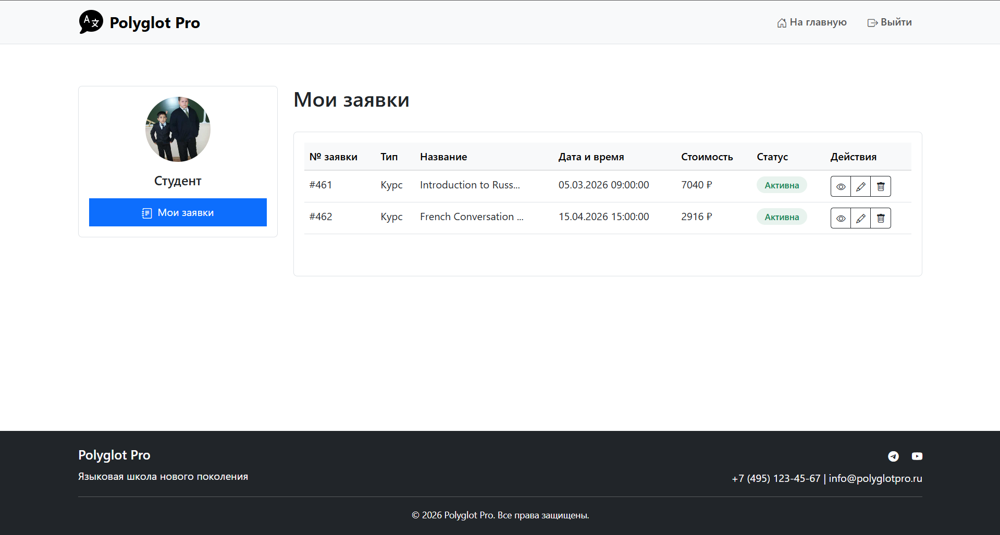

# Отчёт по выполнению экзаменационного задания 
Экзаменационная работа по предмету "Основы Веб-технологий" выполнена студентом группы 241-326 Черновым Владимиром 
## Что сделано:

### 1. HTML страницы
- index.html - главная страница
- account.html - личный кабинет

### 2. CSS стили
- style.css - монохромный дизайн
- Адаптивная вёрстка для мобильных

### 3. JavaScript
- script.js - вся логика сайта

### 4. Изображения
- sources - папка с изображениями, используемыми в проекте

## Функционал:

### Главная страница
- Показ курсов с поиском и фильтрацией
- Таблица репетиторов с фильтрацией
- Кнопка "Подать заявку" на курсы и репетиторов
- Пагинация курсов (по 6 штук)

### Личный кабинет  
- Таблица с заявками пользователя
- Кнопки: Подробнее, Изменить, Удалить
- Пагинация заявок (по 6 штук)

### Модальные окна
- Форма оформления заявки
- Расчет стоимости по формуле из задания
- Дополнительные опции (скидки и надбавки)
- Подтверждение удаления заявки

### Работа с API
- Загрузка курсов, репетиторов, заявок
- Создание, редактирование, удаление заявок
- Передача API ключа в запросах
- Обработка ошибок

## Технологии:
- HTML, CSS, JavaScript
- Bootstrap 5 для стилей и компонентов
- Git для контроля версий разрабатываемого проекта

## Примеры работы приложения

### 1. Главная страница

*Скриншот главной страницы*

### 2. Каталог курсов

*Скриншот каталога курсов (получены через API)*

### 3. Каталог преподавателей

*Скриншот каталога преподавателей (тоже получены через API)*

### 4. Личный кабинет  

*Таблица заявок в личном кабинете пользователя*

### 5. Модальное окно заявки

*Окно заявки с разными полями и доп. услугами*